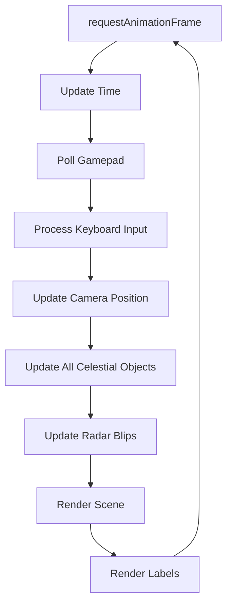

# Architecture

This document describes the high-level architecture of **Cosmos**.

---

## Overview

Cosmos is a modular 3D solar system simulation built with React and Three.js. The architecture follows a **Scene Graph** pattern where every celestial entity is a distinct TypeScript class extending `THREE.Group` or `THREE.Mesh`.

```
┌─────────────────────────────────────────────────────────────┐
│                         BROWSER                             │
│  ┌─────────────────────────────────────────────────────┐   │
│  │                    React 19                          │   │
│  │  ┌──────────────────────────────────────────────┐   │   │
│  │  │                  App.tsx                      │   │   │
│  │  │  • Scene Setup    • Input Handling            │   │   │
│  │  │  • Radar HUD      • Camera Lock-On            │   │   │
│  │  └────────────────────────┬─────────────────────┘   │   │
│  └───────────────────────────┼─────────────────────────┘   │
│                              │                              │
│  ┌───────────────────────────┼─────────────────────────┐   │
│  │                    Three.js Scene                    │   │
│  │  ┌────────────────────────▼────────────────────────┐│   │
│  │  │              Celestial Objects                  ││   │
│  │  │   Sun • Planets (9) • Moons (4) • Asteroids    ││   │
│  │  └─────────────────────────────────────────────────┘│   │
│  └─────────────────────────────────────────────────────┘   │
└─────────────────────────────────────────────────────────────┘
```

---

## Technology Stack

| Layer | Technology | Purpose |
|-------|------------|---------|
| **UI Framework** | React 19 | Component-based UI, state management |
| **3D Renderer** | Three.js | WebGL rendering, scene graph |
| **Language** | TypeScript | Type safety, IDE support |
| **Build** | Vite 7 | Fast HMR, ES modules |
| **Labels** | CSS2DRenderer | HTML labels in 3D space |

---

## Core Concepts

### 1. Cosmos SDK

The SDK (`src/core/SDK.ts`) is the central brain of the simulation:

- **Configuration Hub:** All physics constants, planet data, and visual parameters
- **Utility Functions:** Orbital calculations, opacity fading, smoothstep
- **Type Definitions:** Full TypeScript interfaces for extensibility

```typescript
// Example: SDK provides consistent orbital calculations
const position = Cosmos.getOrbitalPosition(
    initialAngle,
    time,
    config.SPEED,
    config.DISTANCE
);
```

### 2. Scene Graph Pattern

Each celestial body is a self-contained class:

```typescript
// All planets follow this pattern
export class Earth extends THREE.Group {
    public readonly radius: number;
    public readonly moon: THREE.Mesh;
    
    constructor() { /* Create geometry, materials, labels */ }
    update(time: number, camera: THREE.Camera) { /* Orbit, rotate */ }
}
```

### 3. Custom GLSL Shaders

Each planet has unique procedural shaders:

| Planet | Shader Features |
|--------|----------------|
| Sun | Granulation noise, corona, limb darkening |
| Earth | Land/ocean terrain, moving clouds, specular water |
| Venus | Swirling cloud layers, atmospheric rim |
| Ice Giants | Dynamic storm bands, atmospheric scattering |

---

## Directory Structure

```
cosmos/
├── src/
│   ├── App.tsx              # [555 lines] Main component
│   │                        # Scene setup, input handling, radar HUD
│   │
│   ├── core/
│   │   ├── SDK.ts           # [425 lines] Physics engine
│   │   │                    # Constants, utilities, type definitions
│   │   └── InputHandler.ts  # [223 lines] Input processing
│   │                        # Keyboard, mouse, gamepad, camera control
│   │
│   ├── objects/
│   │   ├── Sun.ts           # Star with granulation/corona shaders
│   │   ├── Mercury.ts       # Rocky planet with crater noise
│   │   ├── Venus.ts         # Thick atmosphere with cloud animation
│   │   ├── Earth.ts         # Blue planet + Moon with orbit path
│   │   ├── Mars.ts          # Red planet with thin atmosphere
│   │   ├── Jupiter.ts       # Gas giant + Europa moon + orbit path
│   │   ├── Saturn.ts        # Ringed planet + Titan moon + orbit path
│   │   ├── Uranus.ts        # Ice giant with 97° axial tilt
│   │   ├── Neptune.ts       # Ice giant with storm dynamics
│   │   ├── Pluto.ts         # Dwarf planet + Charon moon + inclined orbit
│   │   ├── AsteroidBelt.ts  # 4000 instanced asteroids
│   │   ├── Stars.ts         # Background starfield
│   │   ├── Atmosphere.ts    # Reusable atmosphere component
│   │   └── OrbitPath.ts     # Orbital path visualization
│   │
│   └── materials/
│       └── Noise.ts         # Shared Simplex noise GLSL functions
│
├── index.html               # Vite entry point
├── package.json             # Dependencies
├── tsconfig.json            # TypeScript config (strict mode)
└── vite.config.js           # Vite configuration
```

---

## Data Flow

### Render Loop



### Input Processing

1. **Keyboard/Mouse:** Event listeners update `inputRef` state
2. **Gamepad:** Polled every frame via `navigator.getGamepads()`
3. **Camera:** 6-DOF movement calculated from combined input
4. **Lock-On:** Camera smoothly interpolates to target position

---

## Performance Considerations

| Optimization | Implementation |
|--------------|----------------|
| **Instanced Rendering** | Asteroid belt uses `InstancedMesh` for 4000 asteroids |
| **Logarithmic Depth Buffer** | Prevents z-fighting across vast distances |
| **Adaptive LOD** | Labels and glare fade based on distance |
| **Cached DOM References** | Radar blips cached in `Map` for O(1) updates |
| **Minimal Re-renders** | Three.js loop decoupled from React render cycle |

---

## Design Decisions

### Why Custom Fly Controls?

**Context:** Needed 6-DOF spaceship movement with gamepad support.

**Decision:** Implemented custom camera logic instead of using `FlyControls` library.

**Rationale:**
- Full control over input combining (keyboard + mouse + gamepad)
- Lock-on camera behavior not supported by library
- Momentum-based zoom with inertia

### Why Embedded Shaders?

**Context:** Each planet needs unique procedural textures.

**Decision:** GLSL shaders embedded as template literals near their components.

**Rationale:**
- Shaders tightly coupled to planet logic
- Easier to maintain (one file per planet)
- No build complexity with `.glsl` imports

---

## Extending the System

### Adding a New Planet

1. Create `src/objects/NewPlanet.ts`:

```typescript
export class NewPlanet extends THREE.Group {
    constructor() {
        super();
        // Create geometry, material, label
    }
    
    update(time: number, camera: THREE.Camera): void {
        const pos = Cosmos.getOrbitalPosition(...);
        this.position.set(pos.x, 0, pos.z);
        // Update label opacity
    }
}
```

2. Add configuration to `SDK.ts`:

```typescript
NEWPLANET: {
    RADIUS: 2.0,
    DISTANCE: 400.0,
    SPEED: 0.2,
    COLOR: new THREE.Color(0xaabbcc),
}
```

3. Instantiate in `App.tsx` and add to radar entities.

---

## Future Considerations

- [x] Extract input handling to separate module *(Done in v1.1.0)*
- [ ] Move shaders to `.glsl` files with Vite imports
- [ ] Add unit tests for SDK utility functions
- [ ] Consider Web Workers for asteroid calculations
