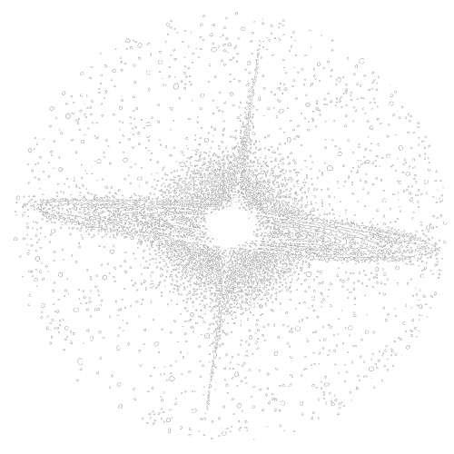

<p align="center">
  
  <h1 align="center"><a href="https://cosmox.vercel.app/">Cosmos</a></h1>
</p>

> **Experience the infinite.** A modular, high-performance 3D solar system simulation running directly in your browser.

Explore the solar system with **2K NASA textures**, realistic orbital mechanics, and a cinematic camera system with gamepad support.


---

## ✨ Features

### 🌍 Complete Solar System
- **9 Planets** with 2K NASA texture maps
- **Earth:** Day/night cycle with cloud layer
- **Saturn:** Procedural ring system
- **Uranus & Neptune:** Subtle ring systems
- **4 Moons:** Moon, Europa, Titan, Charon
- **Asteroid Belt:** 4000 instanced asteroids

### 🏔️ Quantumania System (NEW in v1.6.0)
- **Floating mountains** - 11 unique mountains with distinct themes
- **The Nexus** - Central hub of Quantumania
- **Local lighting** - Volcanic glow, crystal lights, city lights
- **Distant beacon** - Purple pulsing light visible from Solar System
- **Teleportation** - Click radar tabs to travel between systems

### 🎨 Custom Shaders
- **Sun:** Granulation + animated noise + corona
- **Rocky Planets:** Surface textures with lighting
- **Gas/Ice Giants:** Atmospheric effects and rings

### 🥚 Easter Eggs
- **Explorer-1:** Smart touring spaceship with collision avoidance
- **The Kyln:** Massive Nova Corps prison from Guardians of the Galaxy
- **Alien X:** Cosmic entity outside the solar system
- **Sagittarius A\*:** Supermassive black hole at the galactic center with raymarched accretion disk

### 🎮 Controls
| Action | Keyboard | Gamepad |
|--------|----------|---------|
| Move | WASD + R/F | Left Stick |
| Look | Arrows / Mouse Drag | Right Stick |
| Roll | Q/E | L1/R1 |
| Boost | Shift (hold) | RT |
| Zoom | Scroll | D-Pad |
| Labels | L | - |
| HUD | H | - |
| Top View | T | - |
| Unlock | Escape | - |

---

## 🚀 Getting Started

```bash
git clone https://github.com/qtremors/cosmos.git
cd cosmos/cosmos-app
npm install
npm run dev
```

Open `http://localhost:5173`

### Production Build

```bash
npm run build
npm run preview
```

---

## 🛠️ Tech Stack

| Component | Technology |
|-----------|------------|
| Framework | React 19 |
| 3D Engine | Three.js |
| Language | TypeScript |
| Build | Vite 7 |

---

## 📁 Project Structure

```
cosmos/
├── README.md           # This file (source of truth)
├── TASKS.md            # Development tasks
├── CHANGELOG.md        # Version history
└── cosmos-app/
    ├── src/
    │   ├── App.tsx         # Main scene, input, radar
    │   ├── core/
    │   │   ├── SDK.ts      # Physics constants & utilities
    │   │   └── InputHandler.ts
    │   ├── objects/        # All celestial bodies
    │   └── materials/
    │       └── Noise.ts    # Shared GLSL
    └── public/
        └── textures/       # 2K NASA textures
```

---

## ⚙️ Configuration

All parameters in `src/core/SDK.ts`:

| Config | Purpose |
|--------|---------|
| `UNITS` | Solar radius, AU scale |
| `PLANETS` | Radius, distance, speed, eccentricity |
| `CONTROLS` | Fly speed, boost, FOV |
| `RADAR` | Range, entity colors |
| `LIGHTING` | Sun intensity, ambient |

---

## 👷 Contributing

See [TASKS.md](TASKS.md) for open issues.

**Branch Policy:**
- Work on `ag-dev` branch
- Only maintainer merges to `main`

**Adding a Celestial Body:**
1. Add config to `SDK.ts` → `PLANETS`
2. Create class in `src/objects/`
3. Add to scene in `App.tsx`
4. Add to radar entities
5. Update docs

---

## 📝 Changelog

See [CHANGELOG.md](CHANGELOG.md) for full history.

**Recent:**
- **v1.9.0** - Test suite (Vitest), documentation cleanup
- **v1.8.0** - Cosmic Glass UI overhaul, resizable side-by-side panels
- **v1.7.0** - Performance & optimization, cinematic transitions

---

## 📄 License

MIT License. See [LICENSE](LICENSE).

---

<p align="center">
  Made with 💖 by <a href="https://github.com/qtremors">Tremors</a>
</p>
