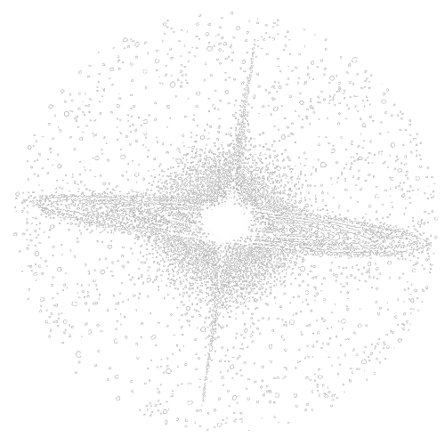

<p align="center">
  
</p>

<h1 align="center"><a href="https://cosmox.vercel.app/">Cosmos</a></h1>

<p align="center">
  <b>Experience the infinite.</b> A 3D space exploration simulator featuring the Solar System, the Quantumania realm, and cosmic easter eggs — built with Three.js and custom GLSL shaders.
</p>

<p align="center">
  
  
  
  
  
  
</p>

> [!NOTE]
> **Personal Project** 🎯 I've always been fascinated by space and the vastness of the cosmos. That passion inspired me to build this project. Feel free to explore and learn from it!

---

## ✨ Features

| Feature | Description |
|---------|-------------|
| 🌍 **Solar System** | True scale, dated positions, 8 planets, 5 dwarf planets, 21 moons, Halley and two belts |
| 🏔️ **Quantumania** | Secondary realm with 26 model entities — mountains, structures, ships, and inhabitants |
| 🎨 **Custom Shaders** | Sun granulation, Earth day/night cycle, raymarched black hole |
| 🎮 **6-DOF Controls** | Keyboard, mouse, gamepad, and touch flight controls |
| 🥚 **Easter Eggs** | Black Hole, The Kyln, Explorer, Alien X |
| 👾 **Arishem** | Massive 3D Cosmic Entity (The Architect) with interior details |
| 📡 **Radar System** | Minimap with entity tracking and teleportation |

---

## Live Website 

**➡️ [cosmox.vercel.app](https://cosmox.vercel.app/)**

Graphics settings offer **Low**, **Medium**, and **High** quality. Start with Low on slower devices; actual performance depends on GPU and browser support. Solar eclipses use analytic shadows at every quality level. Large fictional models load when their area is approached or selected.

On touch devices, hold the flight/boost/roll/zoom buttons and drag the view to look. The object list also provides direct travel. Home or Settings → Reset view returns to the Solar System overview. Selecting an object offers information with NASA sources for astronomical bodies; on narrow screens, tap Object information to keep the view clear.

---

## 🚀 Quick Start

```bash
# Clone and navigate
git clone https://github.com/qtremors/cosmos.git
cd cosmos/cosmos-app

# Install dependencies (Node.js 24 recommended; Node.js 22.13+ also supported)
npm ci

# Run the project
npm run dev
```

Visit **http://localhost:5173** 🎉

---

## 🎮 Controls

| Action | Keyboard | Gamepad |
|--------|----------|---------|
| Move | WASD + R/F | Left Stick |
| Look | Arrows / Mouse | Right Stick |
| Roll | Q/E | L1/R1 |
| Boost | Shift (hold) | RT |
| Next Object | N | - |
| Labels | L | - |
| HUD | H | - |
| Interface navigation | Tab | - |
| Overview | Home / Reset view | - |

---

## 🛠️ Tech Stack

| Layer | Technology |
|-------|------------|
| **Framework** | React 19 |
| **3D Engine** | Three.js 0.182 |
| **Ephemeris** | Astronomy Engine 2.1.19 |
| **Language** | TypeScript 5.9 |
| **Build** | Vite 7 |
| **Testing** | Vitest |

---

## 📁 Project Structure

```
cosmos/
├── cosmos-app/
│   ├── src/
│   │   ├── App.tsx              # React interface; lazy runtime loading
│   │   ├── main.tsx             # Entry point
│   │   ├── index.css            # Global styles
│   │   ├── core/                # SceneController, World, lighting passes, physics, assets, profiling
│   │   ├── objects/             # Component-based 3D entities
│   │   │   ├── solar/           # Planets and moons
│   │   │   ├── quantumania/     # Realm-specific models
│   │   │   └── common/          # Shared 3D objects
│   │   ├── shaders/             # Custom GLSL (sun, earth, blackhole, etc.)
│   │   ├── materials/           # Shared material logic
│   │   ├── components/          # React UI components
│   │   ├── assets/              # Static SVG/Image assets
│   │   └── __tests__/           # Vitest unit tests
│   └── public/
│       ├── textures/            # 2K NASA textures
│       └── models/              # 34 GLB asset files
├── DEVELOPMENT.md               # Architecture & setup
├── CHANGELOG.md                 # Version history
├── TASKS.md                     # Roadmap & backlog
└── LICENSE.md                   # TSL License
```

## 📊 Rendering quality

Open the radar to access Settings. Quality choices persist in the browser and apply without rebuilding the scene.

| Setting | Low | Medium (default) | High |
|---------|-----|------------------|------|
| Solar eclipses | Analytic | Analytic | Analytic |
| Main / Kuiper belt representatives | 500 / 125 | 1000 / 250 | 2000 / 500 |
| Stars | 2000 | 5000 | 8000 |
| Black-hole raymarch steps | 48 | 96 | 150 |
| Maximum pixel ratio | 1 | 1 | 1.5 |

Public assets occupy about 65 MiB on disk; decoded CPU/GPU memory is larger and depends on quality, travel, and the browser. Distant Quantumania/Arishem models are evicted after 30 active seconds away and reload on return. Solar textures remain shared for immediate return travel.

The Solar System starts at the current UTC date at real-time speed, with consistent physical sizes and distances. Settings provides a date selector, accelerated time, orbit guides, automatic exposure and a Fictional extras toggle. The original Quantumania models, Arishem (Cosmic Entity), and Solar System easter eggs remain available by default; turn the toggle off for an astronomy-only view. The object list jumps directly to correctly scaled close-ups; tiny bodies are not enlarged. Pause freezes both clocks while camera controls and loading remain available. Astronomical time advances consistently in every destination.

Planetary/lunar/Galilean positions use Astronomy Engine; the added moons and small bodies use approximate JPL Horizons two-body elements. See [SCIENCE.md](SCIENCE.md) for the reference frame, sources, precision, shape/spin/ring models, tests and omissions.

Settings includes dark-side fill light and downloadable performance measurements. Run `npm run profile` for a repeatable production-build comparison of presets, viewport sizes, and model eviction/reloading. See [PERFORMANCE.md](PERFORMANCE.md) for results, limitations, and the physical-device validation procedure.

---

## 📚 Documentation

| Document | Description |
|----------|-------------|
| [SCIENCE.md](SCIENCE.md) | Physical model, sources and fidelity limits |
| [DEVELOPMENT.md](DEVELOPMENT.md) | Architecture, configuration, contributing |
| [CHANGELOG.md](CHANGELOG.md) | Version history and release notes |
| [PERFORMANCE.md](PERFORMANCE.md) | Measurements and profiling procedure |
| [TASKS.md](TASKS.md) | Current and planned development tasks |
| [LICENSE.md](LICENSE.md) | License terms and attribution |

---

## 🧪 Testing

```bash
cd cosmos-app
npm run check

# Browser regressions
npx playwright install chromium
npm run test:e2e

# Production performance and travel/resource measurements
npm run profile
```

---

## 📄 License

**Tremors Source License (TSL)** - Source-available license allowing viewing, forking, and derivative works with **mandatory attribution**. Commercial use requires written permission.

See [LICENSE.md](LICENSE.md) for full terms.

---

<p align="center">
  Made with ❤️ by <a href="https://github.com/qtremors">Tremors</a>
</p>
